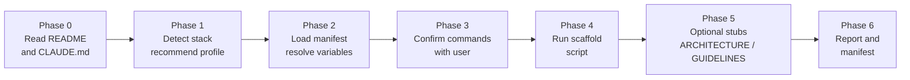
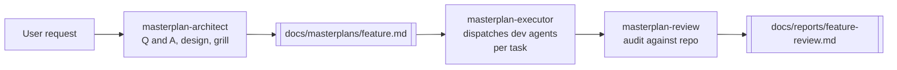

<div align="center">

# Structured Agentic Coding

**Structured agent infrastructure for Claude Code projects.**

[](LICENSE)
[]()

[Quick Start](#quick-start) &middot; [Features](#features) &middot; [Contributing](#contributing)

</div>

---

Install one skill. Get a team of specialized agents — architects, developers, reviewers, testers — wired together through masterplans, coding rules, and quality gates.

```
/structured-agentic-coding:scaffold
```

## Why

AI coding assistants don't scale without structure. Multi-step features get lost in ad-hoc chats, generated code ignores team conventions, and the same mistakes repeat because agents have no memory. This plugin scaffolds a complete `.claude/` infrastructure: agents that plan, build, review, and test — governed by explicit rules and connected through a masterplan workflow.

## Quick Start

> [!NOTE]
> Requires [Claude Code CLI](https://docs.anthropic.com/en/docs/claude-code) and a git repository.

> [!IMPORTANT]
> **macOS users:** requires Bash 4+ and GNU sed. `brew install bash gnu-sed`, then put `gnu-sed/libexec/gnubin` on your PATH. Linux and CI work out of the box.

```
/plugin marketplace add Black2vs2/structured-agentic-coding
/plugin install structured-agentic-coding@structured-agentic-coding
/structured-agentic-coding:scaffold
```

Answer a few questions (project name, profile, commands) and the scaffold writes agents, rules, and templates into your repo. Then:

```
/masterplan
```

### Manual clone

```bash
git clone https://github.com/Black2vs2/structured-agentic-coding.git .
```

Open Claude Code in your target project and run `/structured-agentic-coding:scaffold`.

## The Scaffold Phase

`/structured-agentic-coding:scaffold` walks six phases to detect your stack, confirm commands, and write a self-contained `.claude/` into the repo. Existing files are never overwritten.



Output: `.claude/agents/`, `.claude/rules/*.json`, `.claude/scans/`, commands, templates, and a `.claude/scaffold-manifest.json` used by `/upgrade-agentic-coding` for future upgrades.

## sac-graph

A tree-sitter-backed CLI that gives agents structural navigation over your codebase — faster and more accurate than raw Grep for questions like "who calls this function" or "what breaks if I change this file". The plugin ships it as a PATH shim; the Python venv self-installs on first call. Index lives at `.code-graph/graph.db` and updates incrementally.

| Command | Purpose |
|---|---|
| `sac-graph find-symbol <name>` | Locate symbols (ranked: exact &rarr; prefix &rarr; contains) |
| `sac-graph module-summary <path>` | Directory overview at depth 1/2/3 |
| `sac-graph dependencies <symbol>` | What a symbol depends on |
| `sac-graph dependents <symbol>` | What depends on a symbol |
| `sac-graph blast-radius <target>...` | Affected files, symbols, tests, config |
| `sac-graph test-coverage <symbol>` | Which tests cover a symbol |
| `sac-graph changes-since <commit>` | Symbols added/modified/deleted |
| `sac-graph rebuild` | Full reindex |

Inspired by [code-review-graph](https://github.com/tirth8205/code-review-graph) and built on [tree-sitter](https://tree-sitter.github.io/tree-sitter/).

## Masterplan: Creation &rarr; Execution

A masterplan is a phased, task-level spec committed to `docs/masterplans/`. It's designed and executed by two different skills; the orchestrator routes between them.



- **Architect** — runs interactively in the main chat: orients via `sac-graph`, asks 5-8 clarifying questions, designs a phased plan with tasks (Scope, Files, WHAT/HOW/GUARD, Depends-on, Bloom level, Accept criteria), and commits per phase.
- **Executor** — parses the masterplan, dispatches leaf dev agents per task with the right rules injected, runs targeted review + fix loops with a circuit breaker, and commits per phase. Resume-safe: re-entry picks up at the first unchecked `- [ ]`.
- **Review** — audits a completed plan: verifies task files exist, key decisions were followed, success criteria met, rules not violated, and produces a structured report with lessons learned.

## Research Skills

Two skills feed external and internal evidence into a masterplan *before* design starts.

- **`deep-research`** — autonomous web research with a hard scoping gate. Writes a brief, waits for `go`, then spawns parallel search subagents (one forced disconfirming query) capped by an effort level (`lite`/`balanced`/`max`). A `CitationAgent` pass fetches each source and verifies quotes actually support the claim — unsupported findings are dropped. Sources are mapped to explicit tiers: Tier 1 (official docs, RFCs, specs), Tier 2 (vetted engineering blogs), Tier 3 (SEO farms, ignored). Output: `docs/research/{topic}.md` with citations, tradeoffs, and recommendations.
- **`feature-exploration`** — combines `deep-research` with a `codebase-pattern-match` pass over the local repo, cross-references external evidence against internal exemplars, and produces a proposal with 2-3 implementation options and a recommended pick. Hands off directly to the masterplan-architect.

## Rules (`rules/*.json`)

Each profile ships machine-readable coding rules consumed by reviewers, fixers, and scan playbooks. Agents inject only the rules relevant to a task's scope — keeping context small while enforcing conventions consistently.

```json
{
  "id": "BE-TYPEORM-001",
  "name": "No synchronize: true",
  "category": "typeorm",
  "layer": "entity,config",
  "check": "Flag synchronize: true in any DataSource or TypeOrmModule.forRoot() — in any environment.",
  "why": "Auto-sync bypasses migrations and silently destroys data.",
  "fix": "synchronize: false; apply schema changes via migrations only."
}
```

Rules live at `.claude/rules/be-rules.json` and `.claude/rules/fe-rules.json`, grouped by category (Architecture, TypeORM, Auth, etc.) with stable ID prefixes. Edit them to match your conventions — every review agent picks up the change automatically.

## The Grill (Self + User)

Before a masterplan is handed to the executor, the architect runs it through two rounds of deliberate interrogation — the "roast" phase.

- **Self-Grill** — the architect walks a decision tree against its own plan: Scope (can any task be cut?), Architecture (why this pattern?), Dependencies (could anything run in parallel?), Risk (worst failure mode?), Blast radius (what breaks?), YAGNI (any gold-plating?). Weak answers force a revision before the plan is shown. Optionally delegated to an external model (codex-review, gemini-review) for an independent read.
- **User-Grill** — the user is walked through the same decision tree on the surfaced plan, with a recommended answer per question. Responses feed back into revisions.

Both are recorded in the masterplan's Grill Log so decisions are traceable post-execution.

## Features

| | Base | Angular + .NET | NestJS-query BE | Refine-nestjs-query FE |
|---|---|---|---|---|
| **Scope** | any | fullstack | backend only | frontend only |
| **Agents** | 6 core | +12 stack-specific | +5 | +5 + codegen sync |
| **Coding Rules** | — | 160 (67 BE, 93 FE) | 42 | 44 |
| **Scan Playbooks** | — | 31 (12 BE, 19 FE) | 10 | 10 |

### Commands

| Command | Purpose |
|---|---|
| `/masterplan` | Design and execute a multi-step feature |
| `/masterplan-review` | Audit a completed masterplan |
| `/rebuild-graph` | Force a full `sac-graph` reindex |

### Supported Stacks

- **Base** — framework-agnostic. Works with any language.
- **Angular + .NET** — Angular 17+ (Signals, Nx) + .NET 8+ (Clean Architecture, CQRS/MediatR) + EF Core + Playwright. Fullstack only.
- **NestJS-query BE** — NestJS 11 + TypeORM + `@ptc-org/nestjs-query-*` + Firebase Auth + pg-boss. Backend-only.
- **Refine-nestjs-query FE** — React 19 + Vite 7 + Refine.dev 5 + `@refinedev/nestjs-query` + shadcn/ui + Tailwind 4. Frontend-only.

```
├─ Angular (FE) + .NET (BE) same repo?    → angular-dotnet  (fullstack)
├─ NestJS + @ptc-org/nestjs-query?        → nestjs-query-be (be)
├─ React + Vite + Refine + nestjs-query?  → refine-nestjs-query-fe (fe)
└─ otherwise                              → base
```

<details>
<summary><strong>Project structure</strong></summary>

```
.claude/scaffold/
├── base/                              # Always applied
│   ├── agents/codebase/               # Masterplan, codemap, doc-enforcer
│   ├── agents/domain/                 # Research, impact analyst
│   ├── commands/                      # Slash commands
│   ├── templates/                     # ARCHITECTURE + GUIDELINES templates
│   ├── CLAUDE.md                      # Root documentation template
│   ├── AGENTS.md                      # Agent manifest template
│   ├── anti-patterns.md               # Known failure modes
│   └── settings.json                  # Claude Code harness config
└── profiles/<profile>/                # Stack overlay
    ├── agents/backend/                # BE dev, reviewer, fixer
    ├── agents/frontend/               # FE dev, reviewer, fixer
    ├── scans/                         # Review playbooks
    ├── rules/                         # be-rules.json / fe-rules.json
    └── anti-patterns-profile.md       # Stack-specific pitfalls
```

</details>

## Contributing

Contributions welcome — new profiles, agents, scan playbooks, rules, bug fixes.

1. Fork, branch, change.
2. Test with `/structured-agentic-coding:scaffold` in a sample project.
3. Open a PR.

<details>
<summary><strong>Guidelines</strong></summary>

- **Templates must be self-contained.** Agents discover each other via `.claude/AGENTS.md` and directory scanning.
- **Use `__PLACEHOLDER__` tokens** for values that vary per project.
- **Never overwrite user files.** The scaffold skips existing files.
- **Conventional commits:** `feat:`, `fix:`, `docs:`, `refactor:`.
- **Rules must be actionable** — each needs an ID, description, category, severity, and a check specific enough to verify programmatically.

</details>

<details>
<summary><strong>Adding a new profile</strong></summary>

1. Create `.claude/scaffold/profiles/<profile-name>/`.
2. Add `agents/`, `scans/`, `rules/` as needed.
3. Add `anti-patterns-profile.md`.
4. Update profile list in `.claude/commands/structured-agentic-coding.md` Phase 1.
5. Add detection logic in Phase 2 of the scaffold command.
6. Document it under [Supported Stacks](#supported-stacks).

</details>

## Authors

Built by **Luca Sartori** and **Andrea Gallo** — focused on token-efficient agent systems: minimal context, deferred documentation, scoped prompts, and structured workflows.

## License

MIT
